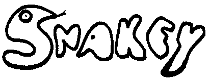
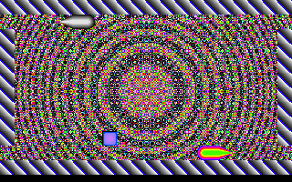
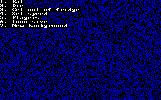
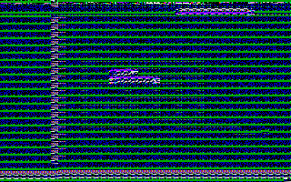
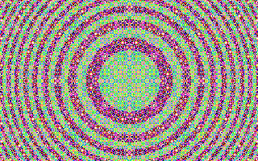
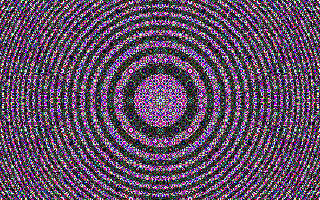
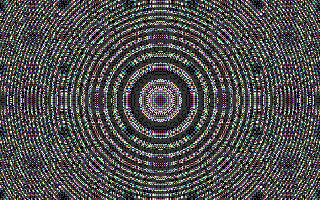
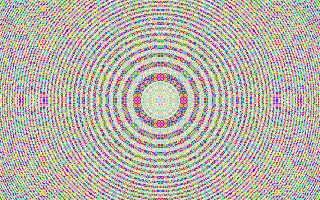
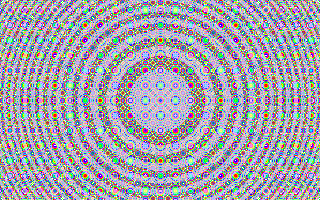
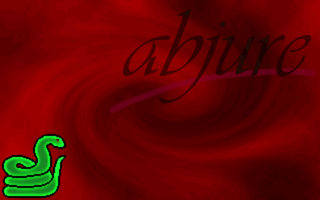

> _Happiness is essentially a state of going somewhere wholeheartedly, one-directionally, without regret or reservation._
> —&nbsp;William H. Sheldon (1898 – 1977)




👉 [PLAY IN BROWSER NOW](https://pengowray.github.io/snakey/js-dos/) 👈

This is Snakey, aka `SNAKE11N.exe`, a two-player snake game I created from scratch in 1995 on a 486dx (33Mhz). It's my first non-trivial project in C. It has VGA graphics (320×200, 256 colours; the same as Doom) and no audio. It uses procedurally generated graphics.

This game was never finished or released before now (31 December 2018). It's quite terrible and should be of little interest to anyone. I dug it up in response to @moshboy's call to "[tweet a gif of the worst videogame you ever made](https://twitter.com/moshboy/status/1079073608712970240)". 

The original executable in /RELEASES. It does not run on Windows 10 without DOSBox. You can try compiling it with Borland Turbo C++, which is happily now [freeware](http://edn.embarcadero.com/article/41337).

# Keys

* Player one: <kbd>1</kbd> <kbd>2</kbd> (turn left, turn right) 
* Player two: <kbd>,</kbd> <kbd>.</kbd> (turn left, turn right), or <kbd>←</kbd> <kbd>↑</kbd> <kbd>→</kbd> <kbd>↓</kbd>  (directional movement)
* Quit: (by dying) or <kbd>ESC</kbd> <kbd>3</kbd>
* Pause: <kbd>P</kbd>
* Game speed: <kbd>+</kbd> <kbd>-</kbd>
* VSYNC toggle: <kbd>*</kbd> (aka "Wait for retrace")
* "Show real game pieces": <kbd>=</kbd>
* Grow both snakes (for no reason): <kbd> \ </kbd> 
* Pause to view the background: <kbd>Enter</kbd>
* Menu: <kbd>ESC</kbd>

# Menu



Menu options: (via <kbd>ESC</kbd>)

1. Eat (both players grow by 6, and moves you closer to reaching the next level)
2. Die (restart)
3. Get out of fridge (quit)
4. Set speed (resets settings to defaults for speed, vsync and "show real pieces")
5. Players (sets the players to 1, which freezes player 2 and seems to make them edible? Player 2 comes back in if you make it to level 2)
6. Icon size (resets the tile size to the default 8x8, but doesn't regenerate the tilemaps leading to weirdness if you started with a different sized tile. I'm not sure why this exists)

> 

> Snakey started with 4x4 tiles (`snake11n.exe 4`) then "Icon size" menu option selected. Why does this exist? Why am I even documenting it? Who knows.

7. New background (generate a random psychedilic background). I've tracked down where I found the algorithm to generate these wallpapers, and it's from [a pseudocode listing](SCREENSHOTS/circle-squared-code-listing.png) in a Scientific American magazine from 1986 of a program called **CIRCLE²** sent in by a reader, **John E. Connett** of  the University of Minnesota, and published in a _Computer Recreations_ article by [A. K. Dewdney](https://en.wikipedia.org/wiki/Alexander_Dewdney) in [Scientific American, Volume 255, Number 3, September 1986](http://ftp.math.utah.edu/pub/tex/bib/toc/sciam1980.html#255(3):September:1986). (`doi:10.1038/scientificamerican0986-14`) <!-- bibliography: doi:10.1038/scientificamerican0986-120 --> I managed to find it because I remembered something called "[Hopalong](http://www.fraktalwelt.de/myhome/simpiter2.htm)" which is another pattern-generating algorithm published alongside it.

Here's some new background samples: 







You can generate countless more.

# Coding stories

In places the code is needlessly efficent. I stored the X and Y positions of the snake's pieces in a pair of (what I now know would be called) circular buffers, but which I called `bitx[]` and `bity[]` at the time (because they stored the bits of the snake position, nothing to do with binary bits). I remember I spent a lot of time debugging to get these arrays working as circular buffers. When the head of snake reached `bitx[200]`, on its next move it would loop back around to `bitx[0]`, eating an old discarded tail segment (or re-using that index of the array anyway). This meant the body of the snake was split in two by the boundaries of the array. This was a royal pain. As soon as it was working, I wished I had permentently nailed the head to `bitx[0]`,`bity[0]` and just shifted the "bits" of its body each frame to keep the array simple. It was immediately obvious that my oriborus array was not a significant optimization. If I'd implemented it the easy way would have meant copying at most around 800 bytes each time a snake moved. I was already copying 64,000 bytes every frame anyway just to update the display and that was no burden on the processor, so 800 (or 1600 for both snakes) would have been nothing. I also didn't abstract away the circular buffer code from the rest of the code very well (at all?), so it's being delt with all throughout the codebase. It certainly taught me to avoid premature optimization.

I also remember spending far too much time making it fair for both players. This was so if both players collided with a wall on the same frame (or with each other, head on), it wouldn't notice one player's death first and declare the other the winner. But Snakey is fair so neither player is favoured (you both lose). That took some effort to do. This, at least, is a thing that could potentially effect the gameplay, much unlike the circular buffer optimization which ultimately did nothing. It's also something I know DOTA 2, with its 500,000 monthly players and $20M tournaments, doesn't do correctly today. In that game if both teams win simultaneously, that is, if if both _ancients_ are destroyed on the same tick, then the Radiant team is favoured. To implement this check correctly in Snakey meant having to create more abstractions, it has to keep a "working draft" of the proposed future state along with the current game state, and I couldn't just mess with the game state directly. It wasn't a straight forward change, and I'm not sure how neatly implemented it is, but I remember, that unlike the mess I made of circular buffers, the project felt more solid, more mature, for having included this "working draft" abstraction.

The code was originally written with the DOS OEM "font" (code page 437), and I used its extended ASCII liberally in my comments, e.g. to tick off TODO list items with square root symbols (√), and draw progress bars. A small selection:

```C
// ∙ Board design (new boards) ░░░░░
// √ Put in crash detection █████ 22th May
// √ Two patterns.. one for each snake ██ 9th June.
// ∙ Scrolling ░░░░░
// ∙ Structure everything better.. use more subroutines ▒░░░░
// ∙ Enemies (plums) ░░░░░
// ∙ Better display screen ███░░
// √ Removing the annoying whr_beg() thing... █████ 
// ∙ Write a better multi player game :) ░░░░░
```

I've converted some of the source files to Unicode now to keep these box graphics visible. Hopefully it still compiles in something.

There seems to be a lot of unused code (and brainstorming ideas) in service of creating levels (or "boards" as I call them in the code). There are actually a number of different levels in the game (a new one every 10 apples) but they're all very simple, generated levels (mostly different borders), and I never got around to making levels where I placed individual tiles. Also there's a bunch of code showing I wanted to use hand-drawn tiles rather than the generated geometric shapes, but storing and loading images appears to have been a bit of a sore point.

The essential source code files are:

`SNAKE11N.C DRAW!.C DRAW!.H ICON6.C WALL!.C`


# Abjure (Snakey 2.0)



The beginning of the end of SNAKEY's development came when I was figuring out the best way to add more stuff to the levels (starting with bouncing plums, the natural enemy of snakes) and I got the idea that it would be easier to manage these new sprites (or object types) using object-oriented (OO) programming techniques. The problem was that I didn't know anything about OO.

I began a complete rewrite in C++, which I'm looking at right now probably for the first time since I wrote it. Snakey 2.0 was called _Abjure_. I wanted it to be a side scroller with a pseudo 3D perspective like Double Dragon, and a jump button too. (Every game genre is better when you can jump. Let's face it, people only play chess for the horse). I can still picture in my head how I wanted it to look when a snake jumps and gets a kink in its body in the z-direction.

I was new to OO but I seem to have understood some OO concepts: "Snake" is a kind of "Item" (sprite), and so is "Food" and "Baddie", and they all share methods for requesting movement, moving, and checking collisions. All good so far. But it looks like I also did some very much _not_ OO design: I'd had planned out how I would make a giant table of every item type and how it would interact with every other item type. I guess the combinatorial explosion of interaction types was too much for me because I didn't get much further than an extended comment around that idea. Perhaps I could see I needed to understand OO better, and this is when I went off to read the original "Design Patterns" book which was revolutionizing the programming world, and that may have led me to learn Java, which was taking the world by storm with its promise of running on toasters. And Snakey was left behind and forgotten. 

The ironic twist is that this DOS game, which dangerously attempts its own memory management and hooks into low-level system interrupts, now runs in a browser. Meanwhile, anything I made in Java, the _run anywhere_ language built from the ground up for security, no longer does. I hope someone makes a "JavaBOX" someday which runs Java in an emulated environment like DOSBox.

# DOSBox

👉 [PLAY IN BROWSER NOW](https://pengowray.github.io/snakey/js-dos/) 👈

Or, to run on your own PC in DOSBox:
```DOSBox
mount c c:\snakey\RELEASES
c:
snake11n.exe 8
```
<kbd>ALT</kbd>+<kbd>ENTER</kbd> for fullscreen.

(the `8` is optional. 8 is the default tile size. Try 4, 16, or 30 for different sizes. Even numbers seem to work better than odd. Too big and it might crash)
